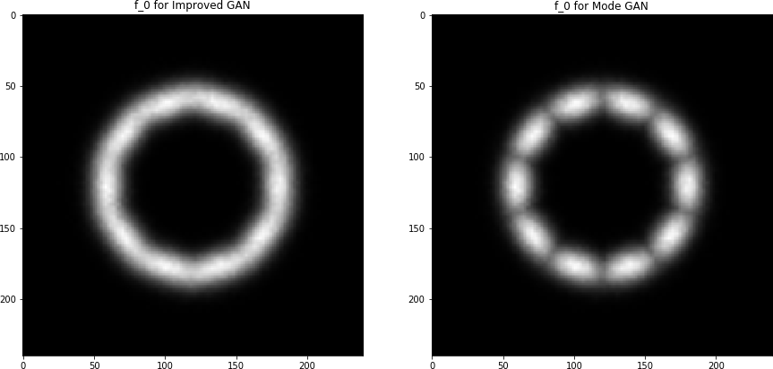

# K+1 GANS examples on Gaussians

What we expect Improved GAN and Mode GAN (with dynamic activation maximization) to learn.



What Mode GAN learns.


Run this example on cpu with:

```
python main.py --d_loss nll --g_loss activation_maximization --n_real_classes 10 --variance 2.0 --ngpu 0
```

## Usage

Run `python -m visdom.server` in another window. 

See:

`python main.py`

Results are displayed at `http://localhost:8097` by default.

## Versioning

- python 3.6.8
- torch '1.0.1'
- cuda/10.0.130 
- cudnn/7.5.0
